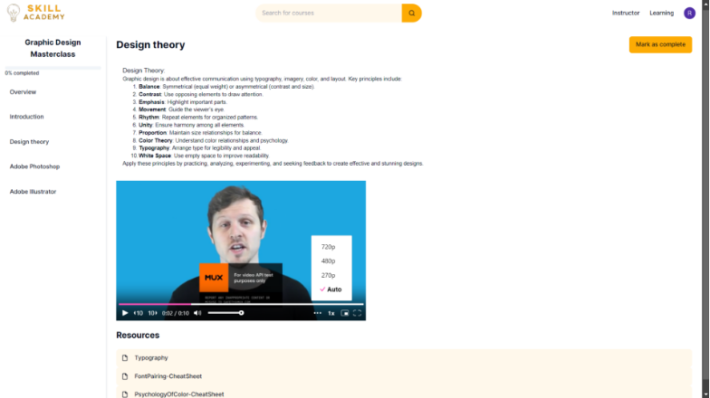
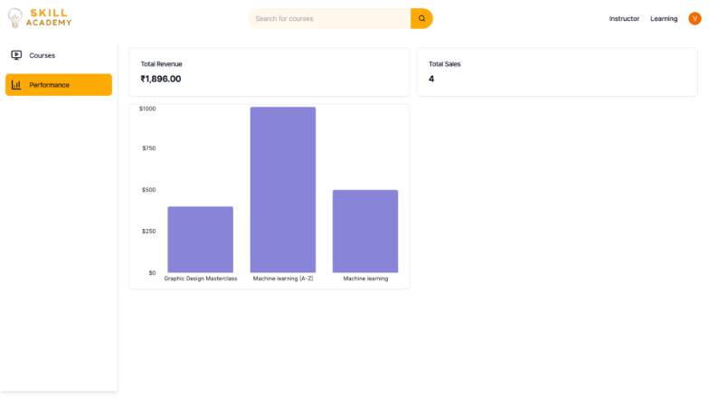

#
# Home Page
### `		`User can buy and study course or can be instructor
### User can filter course based on category

# Course Page
### `		`User can buy course to access it

#

# `		`Payment gateway using Stripe 
`		`Use card number : 4000003560000008

		
# `		`After purchase course is accessible
### `		`Mux player to play the video
		
#		
# Instructor can create new course and can edit existing one
### `		`He can sort it based on title or price
		
# `		`Instructor can publish, unpublish or delete course
### `		`Rich text editor is used for description
## 

## `	         `Each course can have multiple sections,
## `         `Instructor can publish, unpublish or delete section

#
# `                       `Instructor can add resources in form of texts, images, pdfs, audio or videos

## `		`Instructor can make many sections he can drag to change the order

# `		`Dashboard to check total revenue for each course

